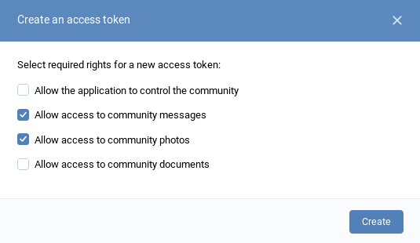
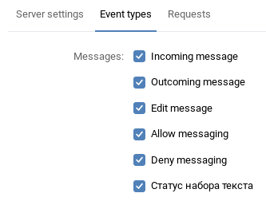

# VK Chat Bot Heroku Guide
This guide will walk you step-by-step through creating your own chat bot for a community using `vk-chat-bot` npm package and [Heroku](https://heroku.com).

## 1. Setting up Heroku
- Visit [signup.heroku.com](https://signup.heroku.com/) and **create an account** there.
- After completing the registration process, visit your [Heroku Dashboard](https://dashboard.heroku.com/apps).
- Create a **new app** with any name that is available.


## 2. Setting up a VK community
- Visit [vk.com/groups](https://vk.com/groups), click `Create community`, and fill in the details:


- In your community, go to `⋅⋅⋅` -> `Manage community`.
- Go to `Messages` tab, and **enable** community messages.
- Go to `Settings` -> `API usage`.
- Create a **new access token** by clicking `Create token`. Make sure to check `Allow access to community messages`:


- **Save** your new **token** somewhere.
- Now switch to the `Callback API` -> `Server settings` tab.
- In the `Secret key` field, enter **your own** random combination of characters.
- Click `Save` below that field.
- Go back to `Server settings` tab and enter in the `URL` field: **https://**`your-app-name`**.herokuapp.com/** (Replace `your-app-name` with the name you specified when creating a new Heroku app in **step 1**).
- **Don't** press `Confirm` and **don't** close this page yet.


## 3. Setting up environment variables in Heroku

- Open the `Settings` tab in your Heroku app, click `Reveal Config Vars`, and **add variables**, as follows:

Variable name | Description | Example value
--- | --- | ---
`VK_API_KEY` | The **token** you saved earlier into somewhere | -
`SECRET` | **Secret key** | `njf4890n39_4f_39fj`
`GROUP_ID` | **Number** that comes after `"group_id":` | `157869221`
`CONFIRMATION_TOKEN` | **String** that comes after `String to be returned:` | `f2111701`

## 4. Creating the bot

- Make sure you have [git](https://git-scm.com/book/en/v2/Getting-Started-Installing-Git) and [Heroku CLI](https://devcenter.heroku.com/articles/heroku-cli#download-and-install) installed.
- Open up terminal (console), and execute the following commands (assuming your project name on Heroku is `some-random-chat-bot`):

```bash
# Clone the example repository
git clone https://github.com/sudoio/vk-chat-bot-example.git

# Go inside the newly-created folder
cd vk-chat-bot-example

# Log in to Heroku
heroku login

# Add the heroku remote
heroku git:remote -a some-random-chat-bot

# Finally, push the bot to Heroku
git push heroku master
```

## 5. Final steps
- Go to your app's **logs** (in Heroku app dashboard -> `More` -> `View logs`)
- If you see a **log message** like one below, then the bot has launched successfully:
```
[i] Server is listening on port 12345.
```
If something is not working, feel free to [open an issue](https://github.com/sudoio/vk-chat-bot/issues) on GitHub.
- Now go back to VK's **Callback API settings**, and press the `Confirm` button.
- Also, in the `Event types` tab, **check** the following boxes:



## 6. Ready!
- Now you can have a conversation with your bot.


