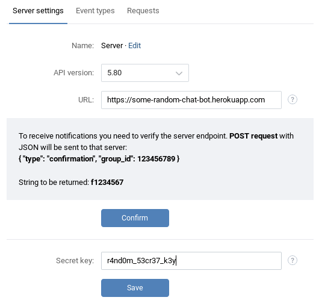

# VK Chat Bot Heroku Guide
This guide will walk you step-by-step through creating your own chat bot for a community using `vk-chat-bot` and [Heroku](https://heroku.com).

## 1. Setting up Heroku
- Visit [signup.heroku.com](https://signup.heroku.com/) and create an account there.
- After completing the registration process, visit your [Heroku Dashboard](https://dashboard.heroku.com/apps).
- Create a new app with any name that is available.

`New` button | `New App` Dialog
--- | ---
 | 

## 2. Setting up a VK community
- Visit [vk.com/groups](https://vk.com/groups), click `Create community`, and fill in the details:


- In your community, go to `⋅⋅⋅` -> `Manage community`.
- Go to `Messages` tab, and enable community messages.

- Go to `Settings` -> `API usage`.
- Create a new access token by clicking `Create token`. Make sure to check `Allow access to community messages`:


- **Save** your new token into Notepad.


- Now switch to the `Callback API` tab.
- In the `Secret key` field, enter **your own** random combination of characters.
- Click `Save`.


- In the `URL` field, enter: **https://**`your-app-name`**.herokuapp.com/** (Replace `your-app-name` with the name you specified when creating a new Heroku app in step 1).
- **Don't** press `Confirm` yet.



## 3. Setting up environment variables in Heroku

- Open the `Settings` tab in your Heroku app, click `Reveal Config Vars`, and add some variables, as follows:

Variable name | Description | Example value
--- | --- | ---
`VK_API_KEY` | The token you saved earlier into Notepad | -
`SECRET` | Secret key | `njf4890n39_4f_39fj`
`GROUP_ID` | Number that comes after `"group_id":` | `157869221`
`CONFIRMATION_TOKEN` | String that comes after `String to be returned:` | `f2111701`

## 4. Creating the bot

- Make sure you have [git](https://git-scm.com/book/en/v2/Getting-Started-Installing-Git) and [Heroku CLI](https://devcenter.heroku.com/articles/heroku-cli#download-and-install) installed.
- Create a new folder for your project on your computer.
- Open up terminal (console) **inside that folder**, and execute the following commands (assuming your project name is `some-random-chat-bot`):

```bash
# Initialize the repository
git init

# Log in to Heroku
heroku login

# Add the heroku remote
heroku git:remote -a some-random-chat-bot
```

- In that folder, create a file called `package.json` with the following content:

```json
{
  "name": "some-random-chat-bot",
  "version": "1.0.0",
  "description": "A chat bot for VK.",
  "main": "index.js",
  "scripts": {
    "test": "echo \"Error: no test specified\" && exit 1"
  },
  "author": "Your Name Here",
  "license": "MIT",
  "dependencies": {
    "vk-chat-bot": "^2.1.0",
  },
}

```

- Now let's create the actual logic for our bot. Create a file `index.js` with this content inside it:

```js
const bot = require('vk-chat-bot');

// process.env gets data from environment variables we have set up in Heroku
const port = process.env.PORT;
var params = {
  vk_api_key: process.env.VK_API_KEY,
  confirmation_token: process.env.CONFIRMATION_TOKEN,
  group_id: process.env.GROUP_ID,
  secret: process.env.SECRET,
  cmd_prefix: "/" // Any command prefix you want
}
bot.init(params);

bot.on("message_allow", (uid) => {
  return "Hello, thanks for allowing us to send you messages.";
});

bot.on("no_match", (uid) => {
  return "I don't know how to respond to your message.";
});

bot.cmd("test", (msg) => {
  return "Test success! Your message content (excluding command) was: \"" + msg + "\".";
});

bot.regex("(hi|hello|hey)", (msg) => {
  return "Hello, I am a test bot.";
});

bot.start(port);
```

- Create a file called `Procfile` with the following content to tell Heroku what to do with your code:

```
web: node index.js
```

- Again, open the terminal (console) **inside that folder**, and execute the following commands:

```bash
# Stage all files
git add .

# Make a commit. You can use any message you like
git commit -m "Initial commit"

# Finally, push the bot to Heroku
git push heroku master
```

## 5. Final steps
- Go to your app's logs (in Heroku app dashboard -> `More` -> `View logs`)
- If you see a message like this one, then the bot has launched successfully:
```
[i] Server is listening on port 12345.
```
- Now go back to VK's Callback API settings, and press that `Confirm` button!

## 6. Ready!
- Now you can have a conversation with your bot.


